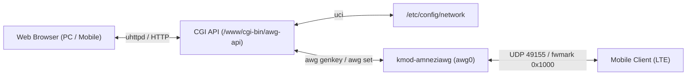

# AwgIt: AmneziaWG Web Manager for OpenWrt

<p align="center">
  <strong>English</strong> • <a href="README.ru.md">Русский</a>
</p>

<p align="center">
  <a href="https://github.com/kobaltgit/AwgIt/releases"></a>
  <a href="LICENSE"></a>
  <a href="https://github.com/kobaltgit/AwgIt/actions/workflows/release.yml"></a>
  
  
</p>

<p align="center">
  <strong>Ultra-lightweight AmneziaWG client web manager running directly on your OpenWrt router.</strong><br>
  <em>Zero overhead • No Docker required • 1-Click QR codes & .conf generation • Sleek dark UI inspired by wg-easy</em>
</p>

<p align="center">
  
</p>

---

## ⚡ Features & Highlights

- 🚀 **0% Background Overhead (Zero-Daemon):** No background daemons, Node.js, Python, or Docker. Runs on-demand via OpenWrt's built-in `uhttpd` and POSIX CGI (`/bin/sh`).
- 🔐 **Admin Auth Guard & Security:** Master password protection with confirmation safeguards and backend validation to prevent unauthorized access.
- 📱 **1-Click Client Onboarding:** Clicking `+ New` generates keypairs (`awg genkey`), assigns next free IP (`10.9.0.x`), and instantly presents an obfuscated QR code (`Jc`, `Jmin`, `Jmax`, `S1`, `S2`, `H1-H4`).
- 📁 **Categories & Accordions:** Organize peers into custom groups (Family, Work, Servers) with 32+ emoji presets, peer counters, and collapsible sections.
- 🔍 **Real-Time Search, Filters & Sorting:** Instant search by name, IP, or notes. Filter by status (`All`, `🟢 Online`, `⚪ Offline`, `⛔ Disabled`) and sort by traffic, activity, or name.
- 📄 **Standalone Client Passport (`client_<name>.html`):** Export completely autonomous HTML passports containing offline Base64 QR codes, a client-side `.conf` download button (no router query needed), and setup guides.
- 🛡️ **Bypass Mobile ISP Throttling & DPI:** Full AmneziaWG protocol obfuscation designed to circumvent strict TSPU/DPI filters and cellular DPI blocks on mobile carriers.
- 🔒 **Isolation from Transparent Proxies (sing-box / Passwall):** Architecture leveraging `fwmark 0x1000` and policy routing rules guarantees direct server replies without conntrack port clashing or routing loops.
- 📊 **Live Telemetry & Real-Time Sparkline:** Real-time SVG activity sparkline, gently breathing glowing session indicators (`status-breathe`), real-time Rx/Tx transfer rates, and handshake telemetry.
- 📱 **Adaptive Mobile Experience (CSS Grid):** Ergonomic 3-tier mobile header, scalable button typography via `clamp()`, and segmented status filter pills without awkward line wraps or horizontal scroll.
- ⚙️ **Settings Tab & PWA Support:** Web panel configuration, telemetry polling intervals (3s / 5s / 10s / paused), batch `.conf` exports, and installable PWA manifest.

---

## 🏗️ Architecture



---

## 📚 Project Documentation

| Document                                              | Description                                                               |
| :---------------------------------------------------- | :------------------------------------------------------------------------ |
| [PROJECT_DESCRIPTION.md](docs/PROJECT_DESCRIPTION.md) | Full architectural specifications, component breakdown, and network model |
| [ROADMAP.md](docs/ROADMAP.md)                         | Project roadmap, development phases, and milestone criteria               |
| [CHECKLIST_v0.2.0.md](docs/CHECKLIST_v0.2.0.md)       | Release v0.2.0 completion and verification checklist                      |
| [BUGS_AND_ISSUES.md](docs/BUGS_AND_ISSUES.md)         | Network incident logs, kernel bug investigations, and applied solutions   |

---

## 🚀 Quick Start (1-Command Install)

### 1. Directly on your OpenWrt router (Recommended):

Connect to your router via SSH and run:

```sh
wget -qO- https://raw.githubusercontent.com/kobaltgit/AwgIt/main/src/install.sh | sh
```

_(To run with Russian logs, append `sh -s -- --lang ru`: `wget -qO- https://raw.githubusercontent.com/kobaltgit/AwgIt/main/src/install.sh | sh -s -- --lang ru`)_

### 2. Remote from PC (Linux / macOS):

```bash
./src/install.sh <ROUTER_IP>
```

### 3. Remote from Windows (PowerShell):

```powershell
.\src\install.ps1 -RouterIp <ROUTER_IP>
```

Once installed, the control panel is ready at: **`http://<ROUTER_IP>/awg`** (e.g. `http://192.168.1.1/awg`).

---

## 📄 License

This project is licensed under the MIT License - see the [LICENSE](LICENSE) file for details.
