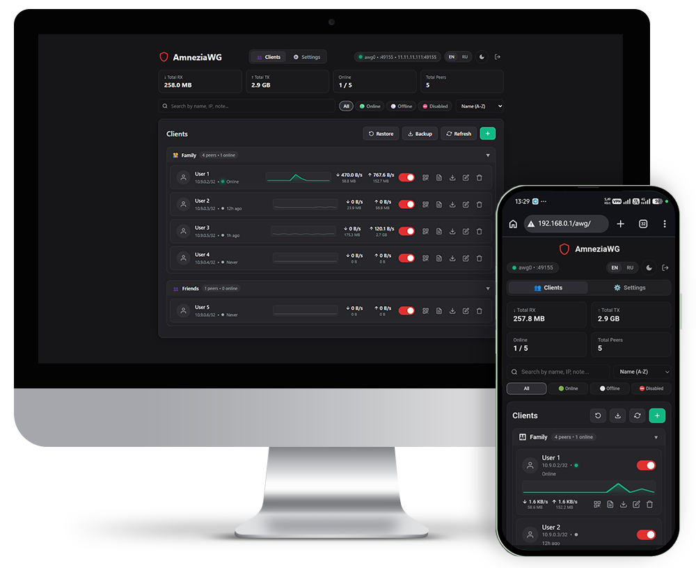
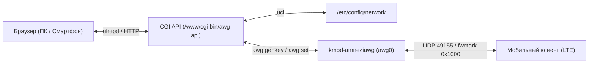

# AwgIt: AmneziaWG Web Manager для OpenWrt

<p align="center">
  <a href="README.md">English</a> • <strong>Русский</strong>
</p>

<p align="center">
  <a href="https://github.com/kobaltgit/AwgIt/releases"></a>
  <a href="LICENSE"></a>
  <a href="https://github.com/kobaltgit/AwgIt/actions/workflows/release.yml"></a>
  
  
</p>

<p align="center">
  <strong>Ультралегковесный веб-интерфейс управления клиентами AmneziaWG прямо на роутере OpenWrt.</strong><br>
  <em>Нулевые накладные расходы • Без Docker • Генерация QR-кодов и .conf в 1 клик • Тёмная тема в стиле wg-easy</em>
</p>

<p align="center">
  
</p>

---

## ⚡ Особенности и Преимущества

- 🚀 **0% фоновой нагрузки:** Никаких демонов, Node.js, Python или Docker. Работает через встроенный `uhttpd` и POSIX CGI (`/bin/sh`).
- 🔐 **Защита панели (Auth Guard):** Мастер-пароль администратора с проверкой подтверждения и валидацией на бэкенде для защиты от случайных ошибок и взлома.
- 📱 **Онбординг клиентов в 1 клик:** Кнопка `+ Новый клиент` генерирует пару ключей (`awg genkey`), назначает IP и мгновенно выводит QR-код со всеми параметрами маскировки (`Jc`, `Jmin`, `Jmax`, `S1`, `S2`, `H1-H4`).
- 📁 **Категории и Аккордеоны:** Организация пиров по группам («Семья», «Работа», «Серверы») с быстрым выбором из 32+ эмодзи, счетчиками клиентов и сворачиваемыми секциями.
- 🔍 **Живой поиск, фильтры и сортировка:** Мгновенный поиск по имени, IP или заметке. Фильтры статусов (`Все`, `🟢 Онлайн`, `⚪ Офлайн`, `⛔ Отключённые`) и сортировка по трафику, активности или имени.
- 📄 **Автономный HTML-паспорт (`client_<name>.html`):** Экспорт самодостаточного HTML-документа со вшитым офлайн QR-кодом (Base64), кнопкой скачивания конфигурации `.conf` прямо в браузере (без обращения к роутеру) и памяткой по настройке.
- 🛡️ **Защита от сотовых блокировок (ТСПУ / DPI):** Поддержка обфусцированного протокола AmneziaWG для стабильной работы через LTE российских операторов (МТС, МегаФон, Билайн, Tele2).
- 🔒 **Изоляция от сторонних прокси (sing-box / Passwall):** Архитектура с `fwmark 0x1000` и политиками маршрутизации гарантирует прямые ответы клиентам без искажения портов со стороны conntrack и без влияния на рабочий трафик нейросетей.
- 📊 **Живая телеметрия и пульс сети:** Векторный бегущий график активности (SVG Sparkline), плавно «дышащий» индикатор сессии (`status-breathe`), объёмы трафика и скорости приёма/отдачи в реальном времени.
- 📱 **Ювелирная адаптивность (CSS Grid):** Сбалансированная 3-ярусная шапка на мобильных, адаптивный размер шрифта кнопок через `clamp()` и сегментированные фильтры без сжатия и без горизонтального скролла.
- ⚙️ **Вкладка настроек и PWA:** Управление группами, смена пароля, выбор интервала опроса (3с / 5с / 10с / пауза), пакетный экспорт конфигов и возможность установки на экран смартфона как PWA-приложение.

---

## 🏗️ Архитектура



---

## 📚 Документация проекта

| Документ                                              | Описание                                                                           |
| :---------------------------------------------------- | :--------------------------------------------------------------------------------- |
| [PROJECT_DESCRIPTION.md](docs/PROJECT_DESCRIPTION.md) | Полное описание архитектуры, компонентов и сетевой модели                          |
| [ROADMAP.md](docs/ROADMAP.md)                         | Дорожная карта, этапы реализации и критерии приемки                                |
| [CHECKLIST_v0.2.0.md](docs/CHECKLIST_v0.2.0.md)       | Чек-лист реализации и верификации задач релиза v0.2.0                              |
| [BUGS_AND_ISSUES.md](docs/BUGS_AND_ISSUES.md)         | Журнал обнаруженных сетевых инцидентов, багов ядра и их решений                    |

---

## 🚀 Быстрый старт (Установка в 1 команду)

### 1. Прямо на роутере OpenWrt (Рекомендуемый способ):

Подключитесь к роутеру по SSH и выполните команду:

```sh
wget -qO- https://raw.githubusercontent.com/kobaltgit/AwgIt/main/src/install.sh | sh -s -- --lang ru
```

### 2. Удалённо с ПК (Linux / macOS):

```bash
./src/install.sh --lang ru <IP_РОУТЕРА>
```

### 3. Удалённо с Windows (PowerShell):

```powershell
.\src\install.ps1 -RouterIp <IP_РОУТЕРА> -Lang ru
```

После завершения панель управления доступна по адресу: **`http://<IP_РОУТЕРА>/awg`** (например, `http://192.168.1.1/awg`).

---

## 📄 Лицензия

Проект распространяется под свободной лицензией MIT — подробности в файле [LICENSE](LICENSE).
