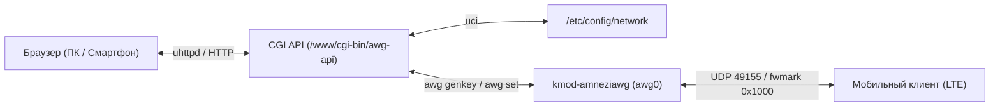

# AwgIt: AmneziaWG Web Manager для OpenWrt

<p align="center">
  <a href="README.md">English</a> • <strong>Русский</strong>
</p>

<p align="center">
  <strong>Ультралегковесный веб-интерфейс управления клиентами AmneziaWG прямо на роутере OpenWrt.</strong><br>
  <em>Нулевые накладные расходы • Без Docker • Генерация QR-кодов и .conf в 1 клик • Тёмная тема в стиле wg-easy</em>
</p>

---

## ⚡ Особенности и Преимущества

* 🚀 **0% фоновой нагрузки:** Никаких демонов, Node.js, Python или Docker. Работает через встроенный `uhttpd` и POSIX CGI (`/bin/sh`).
* 📱 **Онбординг клиентов в 1 клик:** Кнопка `+ Новый клиент` генерирует пару ключей (`awg genkey`), назначает IP и мгновенно выводит QR-код со всеми параметрами маскировки (`Jc`, `Jmin`, `Jmax`, `S1`, `S2`, `H1-H4`).
* 🛡️ **Защита от сотовых блокировок (ТСПУ / DPI):** Поддержка обфусцированного протокола AmneziaWG для стабильной работы через LTE российских операторов (МТС, МегаФон, Билайн, Tele2).
* 🔒 **Изоляция от сторонних прокси (sing-box / Passwall):** Архитектура с `fwmark 0x1000` и политиками маршрутизации гарантирует прямые ответы клиентам без искажения портов со стороны conntrack и без влияния на рабочий трафик нейросетей.
* 📊 **Живая телеметрия и пульс сети:** Векторный бегущий график активности (SVG Sparkline), плавно «дышащий» индикатор сессии (`status-breathe`), объёмы трафика и скорости приёма/отдачи в реальном времени.
* 📱 **Честная адаптивность (CSS Grid):** Продуманная 3-ярусная раскладка на смартфонах без потери метрик скорости и без горизонтального скролла.

---

## 🏗️ Архитектура



---

## 📚 Документация проекта

| Документ | Описание |
|:---|:---|
| [PROJECT_DESCRIPTION.md](docs/PROJECT_DESCRIPTION.md) | Полное описание архитектуры, компонентов и сетевой модели |
| [ROADMAP.md](docs/ROADMAP.md) | Дорожная карта, этапы реализации и критерии приемки |
| [BUGS_AND_ISSUES.md](docs/BUGS_AND_ISSUES.md) | Журнал обнаруженных сетевых инцидентов, багов ядра и их решений |

---

## 🚀 Быстрый старт (Установка в 1 команду)

### 1. Прямо на роутере OpenWrt (Рекомендуемый способ):
Подключитесь к роутеру по SSH и выполните команду:
```sh
wget -qO- https://raw.githubusercontent.com/kobaltgit/AwgIt/main/src/install.sh | sh -s -- --lang ru
```

### 2. Удалённо с ПК (Linux / macOS):
```bash
./src/install.sh --lang ru <IP_РОУТЕРА>
```

### 3. Удалённо с Windows (PowerShell):
```powershell
.\src\install.ps1 -RouterIp <IP_РОУТЕРА> -Lang ru
```

После завершения панель управления доступна по адресу: **`http://<IP_РОУТЕРА>/awg`** (например, `http://192.168.1.1/awg`).
