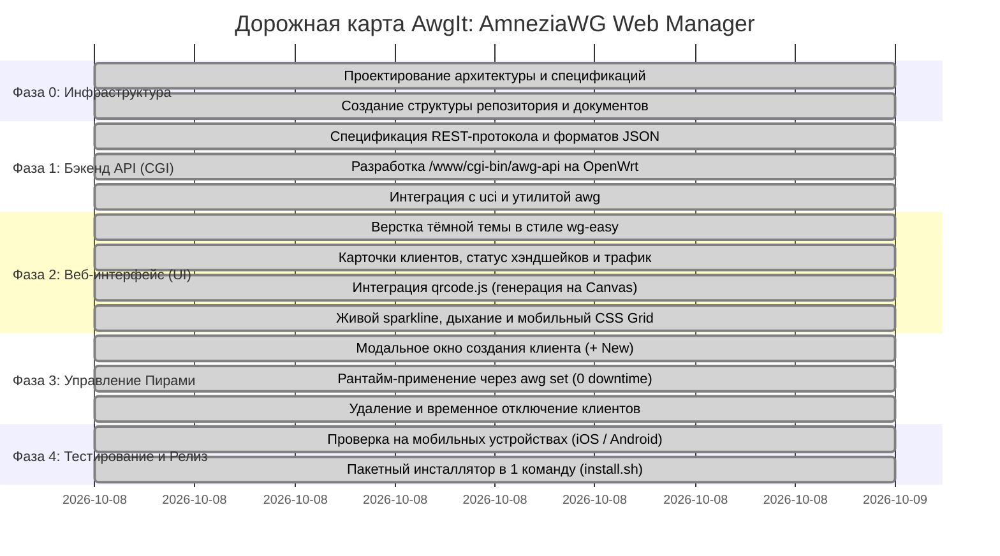

# Дорожная карта разработки AwgIt (Roadmap)

В данном документе зафиксированы ключевые фазы разработки, контрольные точки (Milestones) и критерии приемки проекта **AwgIt**.

---

## График фаз разработки

---

## Детализация по фазам

### Фаза 0: Инициализация и архитектурный фундамент (Завершена)
* **Цель:** Сформировать концепцию, описать архитектуру и развернуть стандартизированную структуру документации в соответствии с экосистемой пользователя.
* **Результаты:**
  1. Развернута директория проекта `D:\projects\active\AwgIt`.
  2. Подготовлены документы: `PROJECT_DESCRIPTION.md`, `ROADMAP.md`, `BUGS_AND_ISSUES.md`, `CHRONICLE.md`.
  3. Проверена готовность ядра OpenWrt (`kmod-amneziawg`, `awg0` на порту 49155 с `fwmark 0x1000`).
* **Критерий приемки (Milestone 0):** Документация утверждена, структура папок готова.

---

### Фаза 1: Разработка Backend CGI API (`/www/cgi-bin/awg-api`)
* **Цель:** Создать легковесный обработчик на `/bin/sh`, выполняемый сервером `uhttpd` без сторонних зависимостей.
* **Задачи:**
  * Обработка `GET ?action=status`: парсинг `awg show awg0` и `uci show network`, сбор статистики трафика, хэндшейков и IP.
  * Обработка `POST ?action=create`: чтение параметров, вызов `awg genkey`, расчет свободного IP в пуле `10.9.0.0/24`, запись в UCI и применение через `awg set`.
  * Обработка `POST ?action=delete`: удаление секции пира из UCI и вызов `awg set awg0 peer <key> remove`.
  * Форматирование ответов в чистый JSON.
* **Критерий приемки (Milestone 1):** Скрипт корректно отвечает на curl-запросы с валидным JSON-ответом.

---

### Фаза 2: Frontend SPA Интерфейс (`/www/awg/index.html`)
* **Цель:** Реализовать адаптивный веб-интерфейс в тёмной теме, визуально соответствующий референсу `wg-easy`.
* **Задачи:**
  * Верстка карточек пиров: статус (онлайн/офлайн на основе времени хэндшейка < 180с), объемы переданного/принятого трафика, имя, IP-адрес.
  * Верхняя панель: статус сервера, порт 49155, общий счетчик активных клиентов, кнопка `+ Новый клиент`.
  * Встраивание автономного генератора QR-кодов (`qrcode.min.js`, вшитый локально, без обращений к внешним CDN).
  * Живая телеметрия: векторный бегущий график сетевой активности (SVG Sparkline) скользящего окна.
  * Плавный индикатор «Мягкое дыхание» (`status-breathe`) с GPU-ускорением.
  * Полная адаптивность под смартфоны: трехуровневая CSS Grid сетка карточки без скрытия скоростей и без горизонтального скролла.
* **Критерий приемки (Milestone 2):** Страница корректно отображает список пиров при открытии в браузере с ПК и телефона с плавной телеметрией и идеальной сеткой.

---

### Фаза 3: Генерация и управление клиентами в 1 клик
* **Цель:** Обеспечить мгновенный онбординг новых устройств без ручного редактирования файлов.
* **Задачи:**
  * Модальное окно создания клиента: ввод имени пира.
  * Генерация полной конфигурации с обязательными полями:
    * `[Interface]`: PrivateKey, Address (`10.9.0.x/24`), DNS (`10.9.0.1, 77.88.8.8`), параметры обфускации (`Jc`, `Jmin`, `Jmax`, `S1`, `S2`, `H1-H4`).
    * `[Peer]`: PublicKey сервера, Endpoint (`62.16.41.168:49155`), `AllowedIPs = 0.0.0.0/0`, `PersistentKeepalive = 25`.
  * Отрисовка QR-кода на экране для сканирования из приложения AmneziaWG.
  * Кнопка скачивания `.conf` файла.
* **Критерий приемки (Milestone 3):** Отсканированный с экрана QR-код успешно подключается к серверу без ручных правок.

---

### Фаза 4: Оптимизация, инсталлятор и релиз
* **Цель:** Упаковать решение для быстрой установки в 1 команду и проверить надежность.
* **Задачи:**
  * Создание скрипта автоматической установки `install.sh`.
  * Проверка сохранения конфигурации при перезагрузке роутера (`sysupgrade`).
  * Полный цикл регрессионного тестирования на сотовой сети (LTE).
* **Критерий приемки (Milestone 4):** Инсталляция на чистый роутер одной командой, стабильное подключение всех добавленных клиентов.

---

### Фаза 5: Аудит безопасности, лицензирование и релиз v0.1.0 (Завершена)
* **Цель:** Устранить замечания внешнего аудита, внедрить открытую лицензию и обеспечить надежную санитизацию данных.
* **Задачи:**
  * Добавление свободной лицензии **MIT License** (`LICENSE`) и соответствующих бейджей в `README.md` / `README.ru.md`.
  * Аудит безопасности бэкенда (`src/awg-api`): строгая валидация Base64-ключей, CIDR IPv4 и санитизация имен клиентов.
  * Устранение непереносимых конструкций для гарантированной совместимости с BusyBox ash (`urldecode`).
  * Фиксация LF-окончаний строк в `.gitattributes`.
  * Разработка комплекта автоматизированных тестов (`tests/test_input_validation.sh`, `tests/test_cgi_mock.sh`).
* **Критерий приемки (Milestone 5):** Все тесты пройдены, бэкенд устойчив к некорректным входным данным, проект готов к публичному релизу v0.1.0.
