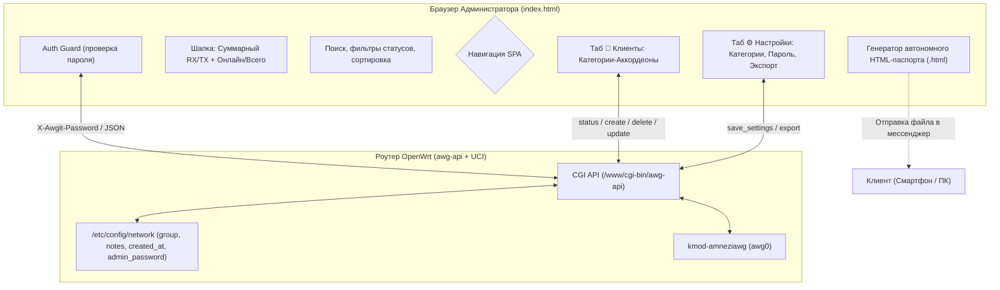

# План реализации AwgIt v0.2.0

В данном документе зафиксирована архитектура, спецификации и дизайн расширенного функционала AwgIt в строгом соответствии с концепцией **«0% фоновой нагрузки на роутер»**: без внешних СУБД, без тяжелых рантаймов и без фоновых демонов на OpenWrt.

---

## 1. Концепция и цели релиза

1. **Безопасность административной панели:**  
   Поскольку доступ к веб-серверу роутера открыт из туннеля `awg0`, необходима защита панели паролем, чтобы подключённые клиенты VPN не могли просматривать и модифицировать чужие конфигурации.
2. **Организация и структурирование клиентов:**  
   Переход от плоского списка к гибким категориям-аккордеонам с визуальными эмодзи, счетчиками активности, поиском и фильтрацией.
3. **Бесшовный шеринг (Автономный HTML-паспорт клиента):**  
   Генерация единого самодостаточного HTML-файла на клиенте админа со встроенным Base64 QR-кодом, скриптом скачивания `.conf` и инструкцией для пересылки через Telegram/WhatsApp.
4. **Центр управления («⚙️ Настройки»):**  
   Выделенный раздел SPA для администрирования групп, пароля доступа, параметров телеметрии и пакетного экспорта.
5. **Глобальная аналитика и мобильность:**  
   Суммарный дашборд трафика в шапке и PWA-манифест для добавления панели на домашний экран смартфонов.

---

## 2. Архитектура решения



---

## 3. Спецификация изменений по компонентам

### 3.1. Бэкенд CGI API (`src/awg-api`)

1. **Хранение данных в подсистеме OpenWrt UCI:**
   * В секциях пиров `amneziawg_awg0`:
     * `option group '...'` — категория клиента (строка, до 32 символов).
     * `option notes '...'` — заметка администратора (строка, до 128 символов).
     * `option created_at '...'` — UNIX timestamp момента добавления.
   * В общей секции настроек `network.awgit_settings`:
     * `option admin_password '...'` — пароль администратора (sha256 хэш или токен).
     * `list categories '...'` — перечень категорий с эмодзи.
2. **Авторизация (Auth Guard):**
   * Если пароль установлен, все методы API сверяют входящий токен/пароль из заголовка `X-Awgit-Password` или параметра `password`.
   * При несоответствии возвращается ответ:
     ```json
     {"status":"error","code":"unauthorized","message":"Требуется пароль администратора"}
     ```
3. **Новые и обновленные методы API:**
   * `action=status`: отдает список пиров с полями `group`, `notes`, `created_at`, а также список категорий и флаг `auth_required`.
   * `action=create`: принимает необязательные поля `group` и `notes`, автоматически проставляет `created_at`.
   * `action=update_peer`: обновляет `description`, `group`, `notes` существующего пира в UCI без перезапуска интерфейса и смены ключей.
   * `action=set_password`: устанавливает или сбрасывает мастер-пароль.
   * `action=save_categories`: сохраняет актуальный список категорий.

---

### 3.2. Веб-интерфейс (`src/index.html`)

1. **Система аутентификации:**
   * Проверка наличия сохраненного пароля в `localStorage`.
   * Модальное окно блокировки интерфейса при отсутствии авторизации.
2. **Суммарный дашборд в шапке:**
   * Карточки суммарного трафика интерфейса: `↓ Всего RX`, `↑ Всего TX`.
   * Индикатор доли активных пиров: `🟢 Онлайн: X из Y`.
3. **Панель инструментов (Поиск, Фильтры, Сортировка):**
   * Текстовое поле поиска с фильтрацией по имени, IP или заметке.
   * Быстрые табы-фильтры: `Все`, `Онлайн` (< 180с), `Офлайн`, `Отключённые`.
   * Выпадающий список сортировки: по имени, по объему трафика, по последнему хэндшейку, по дате добавления.
4. **Категории и Аккордеоны:**
   * Разделение списка на блоки категорий.
   * Сворачивание и разворачивание по клику на заголовок группы.
   * Сохранение состояния свернутости каждой группы в `localStorage`.
   * Бейджи активности: `(Всего: 4 • Онлайн: 2)`.
5. **Вкладка «⚙️ Настройки»:**
   * Табы в шапке: `[👥 Клиенты]` и `[⚙️ Настройки]`.
   * Блок «Управление категориями»: добавление новой группы, палитра из 32 эмодзи + поле ручного ввода, удаление группы с безопасным переносом клиентов.
   * Блок «Безопасность»: установка и изменение пароля администратора.
   * Блок «Интерфейс»: интервал обновления телеметрии (3с / 5с / 10с / пауза).
   * Блок «Экспорт»: пакетная выгрузка всех конфигураций клиентов.
6. **Автономный HTML-паспорт клиента:**
   * Кнопка экспорта в карточке пира и модальном окне QR-кода.
   * Генерация однофайлового документа с векторным/Base64 QR-кодом, скриптом локального сохранения `.conf` через Blob и наглядной инструкцией по подключению.

---

### 3.3. PWA и манифест (`src/manifest.json`)
* Полноэкранный автономный режим для смартфонов (iOS / Android).
* Иконки приложения и фирменная цветовая гамма (`#161618`).

---

## 4. Верификация и тесты

* Тестирование CGI-парсера и санитизации в POSIX shell окружении (`tests/test_cgi_mock.sh`).
* Проверка совместимости с BusyBox ash на чистом роутере OpenWrt.
